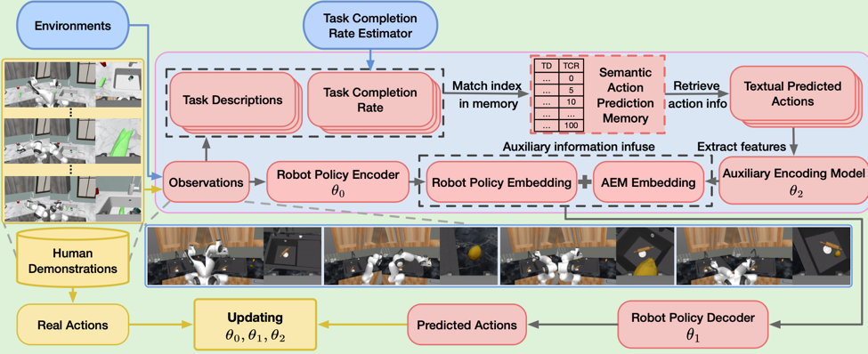

# Seamless Knowledge Infusion for Robot Learning

This repository contains the codebase for the Seamless Knowledge Infusion for Robot Learning (SKIRL). In this project, 
we aim to develop a framework that enables robots to learn from human demonstrations and vision language model(VLM)-provided knowledge. 
The framework is built on top of the RoboCasa codebase, which provides a simulation environment for training and evaluating robotic agents.


-------
## Installation

1. Clone the repository
```bash
git clone https://github.com/mrvgao/completion-infuse-robot
```

2. Set up conda environment:
```bash
conda create -c conda-forge -n skirl python=3.10
```

3. Activate conda environment:
```bash
conda activate skirl
```

4. Clone and setup robosuite dependency (important: use the master branch!):
```bash
git clone https://github.com/ARISE-Initiative/robosuite
cd robosuite
pip install -e .
cd .. 
git clone https://github.com/ARISE-Initiative/robomimic -b robocasa
cd robomimic
pip install -e .
```

5. Setup this repo:
```bash
cd .. 
git checkout using-openai-action-train-from-scratch
git install -e
```

6. Install the package and download assets:
```bash
python robocasa/scripts/download_kitchen_assets.py   # Caution: Assets to be downloaded are around 5GB.
python robocasa/scripts/setup_macros.py              # Set up system variables.
```

7. Download training data for kitchen environment:
You can know more about dataset in [robocasa document](https://robocasa.ai/docs/use_cases/downloading_datasets.html)
```bash
# downloads all human datasets with images
python -m robocasa.scripts.download_datasets --ds_types human_im

# lite download: download human datasets without images
python -m robocasa.scripts.download_datasets --ds_types human_raw

# downloads all MimicGen datasets with images
python -m robocasa.scripts.download_datasets --ds_types mg_im
```

In SKIRL project, what we need is mg_im and human_im

-------
## Quick Start 

After your installation setting up, you can run the following command to train the model:
```bash
python robomimic/scripts/train.py --config <config-path>
```

The different configurations are listed in the robomimic/scripts/run_configs

------ 
## Project Structure

The main components of the project are:

1. Semantic Action Prediction Memory (SAPM): This module is responsible for predicting the next action given the current state and the knowledge provided by the VLM. 
2. Training Pipeline: This module is responsible for training the SAPM model using the data collected from the RoboCasa environment and the SAPM's predictions.
3. Inferencing Pipeline: This module is responsible for using the trained SAPM model to predict the next action given the current state and the knowledge provided by the VLM.
